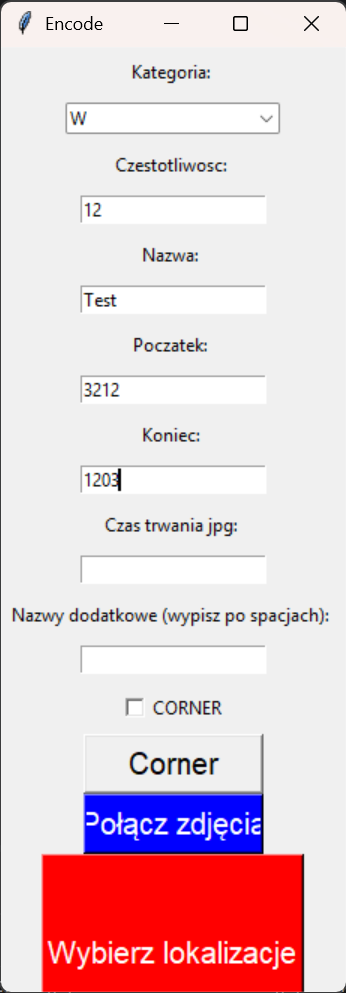

# Spotonazywacz

Spotonazywacz to inteligentne narzędzie w języku Python służące do pobierania i zarządzania plikami muzycznymi. Program automatycznie dba o poprawne metadane oraz przejrzyste nazewnictwo Twojej biblioteki audio.

## 🚀 Pobieranie (Dla użytkowników)

Jeśli nie jesteś programistą i chcesz po prostu użyć programu:
1. Przejdź do sekcji **[Releases](https://github.com/MrRobinMr/Spotonazywacz/releases)** po prawej stronie.
2. Pobierz najnowszą wersję pliku `.exe` (lub paczkę `.zip`).
3. Pamiętaj, że program do poprawnego działania wymaga folderu `ffmpeg` w tym samym katalogu.

---

## 🛠️ Instalacja i Rozwój (Dla programistów)

Projekt został zaprojektowany tak, aby maksymalnie uprościć proces przygotowania środowiska. Dzięki zintegrowanemu skryptowi instalacyjnemu nie musisz ręcznie konfigurować bibliotek ani pobierać FFmpeg.

### Wymagania
* **System operacyjny:** Windows
* **Python:** wersja 3.10 lub nowsza

### Szybki Start
1. **Sklonuj repozytorium** lub pobierz kod źródłowy.
2. **Uruchom instalator:**
   Kliknij prawym przyciskiem myszy na plik `install.ps1` w głównym folderze i wybierz **"Uruchom z PowerShell"**.
   
   *Skrypt automatycznie:*
   * Utworzy środowisko wirtualne (**venv**).
   * Zainstaluje wymagane biblioteki (**pip**).
   * Pobierze i skonfiguruje oficjalne pliki binarne **FFmpeg**.
   * Doda FFmpeg do zmiennych środowiskowych systemowych.

3. **Uruchom program:**
   Po zakończeniu instalacji wpisz w terminalu:
   **python main.py**

## 🔧 Rozwiązywanie problemów

* **Błąd PowerShell:** Jeśli system blokuje skrypt, otwórz PowerShell jako Administrator i wpisz: 
  `Set-ExecutionPolicy RemoteSigned -Scope CurrentUser`, a następnie spróbuj ponownie.
* **FFmpeg nie działa:** Jeśli program nie przetwarza plików po instalacji, zrestartuj swój edytor (np. VS Code) lub komputer, aby odświeżyć ścieżki systemowe (PATH).

## 👤 Autor

**Jakub Nowak**
* GitHub: [@MrRobinMr](https://github.com/MrRobinMr)

---
*Projekt ma charakter edukacyjny. Pamiętaj o przestrzeganiu praw autorskich do pobieranych treści.*
